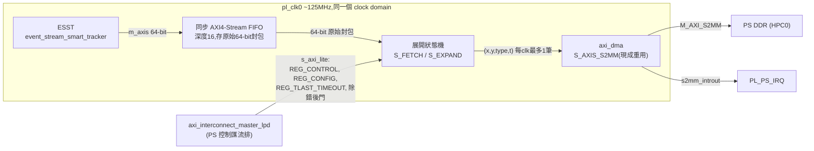
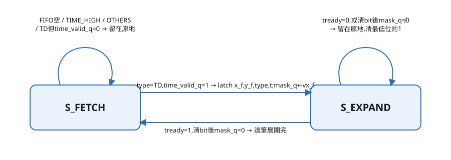

# FPGA:ps_host_if 替換——查證筆記

本文件是 [`Todo/ps_host_if_replacement_todo.md`](../Todo/ps_host_if_replacement_todo.md) 的支撐材料:每個結論的原始碼出處、行號、推理過程。TODO 檔案只寫結論跟待辦,細節查證放這裡,避免 TODO 檔案混進大段引用。

所有結論都標明來源檔案與查證方式。沒有查證過的部分明確標示為「未查證」,不補完、不用推論代替查證結果。

外部原始碼已複製到本專案 `docs/FPGA/Reference/KV260/` 底下,以下所有路徑都指向這個本機複本,不是原始位置(`D:\FPGA\KV260_bringup`)。

## 展開狀態機:架構圖與 FSM(定案)

架構:



FSM,2 個狀態(`S_FETCH`/`S_EXPAND`,1 bit 編碼)。mermaid 對 self-loop 的渲染是已知未解決的排版問題([mermaid-js/mermaid#6336](https://github.com/mermaid-js/mermaid/issues/6336)),改用手繪 SVG(`assets/decoder_fsm.svg`),self-loop 用真正的 bezier 曲線,不靠 mermaid 自動排版：



轉移對應的完整動作(圖只是骨架,細節在這裡查)：

| 轉移 | 條件 | 動作 |
|---|---|---|
| `S_FETCH` 留在原地 | FIFO 空 | 什麼都不做,等下一拍 |
| `S_FETCH` 留在原地 | `type=TIME_HIGH` | `time_high_q←新值`,`time_valid_q←1` |
| `S_FETCH` 留在原地 | `type=OTHERS或其他` | 丟棄 |
| `S_FETCH` 留在原地 | `type=TD, time_valid_q=0` | 丟棄(時間還沒就緒) |
| `S_FETCH → S_EXPAND` | `type=TD, time_valid_q=1` | `latch x_f,y_f,type,t`,`mask_q←vx_f` |
| `S_EXPAND` 留在原地 | `tready=0` | 輸出保持不變,不清 bit |
| `S_EXPAND` 留在原地 | `tready=1`,清完 bit 後 `mask_q≠0` | 清最低位的 1 |
| `S_EXPAND → S_FETCH` | `tready=1`,清完 bit 後 `mask_q=0` | 這筆展開完 |

**暫存器**：`time_high_q`(28-bit 時間高位)、`time_valid_q`(1-bit,是否收過至少一次 `TIME_HIGH`,reset 後為 0)、`x_f_q`/`y_f_q`/`type_q`/`t_q`(這筆 TD 封包固定值,展開期間不變)、`mask_q`(`vx_f` 殘餘 mask,`S_EXPAND` 每拍清一個 bit)。

**`time_valid_q` 存在的理由**:對照 PS 端軟體 `evt21_decoder.h` 的 `decode_impl()`——`base_time_set_` 為 false 時,掃過整個 buffer 找第一筆 `TIME_HIGH`,在那之前的事件全部丟棄(原始碼註解:「we don't have a base time to work with」)。新模組沒有這個 flag 的話,reset 後第一筆 TD 事件會用未初始化的 `time_high_q` 組出錯誤的 `t`。

**bit-scan 展開演算法**:每拍只存一顆會縮小的 `mask_q` 暫存器跟這筆封包的固定值,不存 32 筆展開好的資料。組合邏輯每拍從目前 `mask_q` 找最低位的 1,算出 offset,清掉那個 bit,重複到歸零。對照 PS 端軟體 `evt21_decoder.h` 第 150–157 行的 `ctz_not_zero` 迴圈。

**FIFO 深度**:16 筆(0~15,4-bit 指標),存原始未解碼封包,不是已解碼事件——理由見上方「PS 端現有控制流程」前的架構討論。

## 新模組的 AXI-Lite 控制介面(定案)

新模組除了 AXI4-Stream 資料路徑,還需要一個 `s_axi_lite` slave port 給 PS 端控制,理由見下方各暫存器說明。對照對象是 `psee-event-stream-smart-tracker.c`(ESST)、`psee-dma.c`(`ps_host_if`)這兩顆現有 IP 的暫存器設計模式。

| 暫存器 | 內容 | 理由/對照 |
|---|---|---|
| `REG_CONTROL` | `enable`/`reset`/`clear` | 沒有這個,V4L2 的 `STREAMON`/`STREAMOFF`/pipeline 開關機制沒有東西可以控制。用法對照 `psee-dma.c`:`reset` 只在 driver 初始化用一次;`enable` 對應 `STREAMON`/`STREAMOFF`;`clear` 在 `STREAMOFF` 時跟 `enable=0` 一起下,把 FIFO 裡處理到一半的舊封包清空,避免下次開始擷取時混進上次的殘留資料 |
| `REG_CONFIG.enable_pattern` | 開啟後模組自己吐固定/遞增的假 `(x,y,type,t)`,不吃 FIFO 的真資料 | 除錯用:不用等展開狀態機 RTL 全部寫完、也不用接真感測器,就能先驗證 `axi_dma` → kernel driver → PS 軟體這條路通不通。對照 `ps_host_if` 的 `REG_CONFIG.enable_pattern`,同樣用途 |
| `REG_TLAST_TIMEOUT` | `flush_timer_q` 的比較門檻,PS 可調 | 不寫死的理由:AXI-Lite 介面反正都要做,多開一個暫存器成本很低;寫死的話以後要調數字得重新合成整個 FPGA。對照 `ps_host_if` 的 `REG_TLAST_TIMEOUT`(PS 端做成 `V4L2_CID_XFER_TIMEOUT_THRESHOLD`) |
| 除錯讀寫後門 | 開放對整個 AXI-Lite 位址空間做原始讀寫,不限於上面幾個具名暫存器 | 除錯彈性:不用每次想看內部狀態就多定義一個具名暫存器。對照 ESST/`ps_host_if` 的 `g_register`/`s_register`(`CONFIG_VIDEO_ADV_DEBUG` 編譯開關控制) |

**不做成暫存器的東西**:FIFO 深度(16 筆)——這是實體記憶體大小,合成時就決定,不是邏輯參數,沒有「暫存器成本低」這回事。

## EVT2.1 事件格式:64-bit 一筆,逐 bit 對照表

來源:`D:\Project\CSNN-FPGA\docs\FPGA\Reference\KV260\fpga-projects-1.0.0\ip\event_stream_smart_tracker_2_0\hdl\ccam_evt_type_v2_1_pkg.vhd`(已讀 1–620 行,共 761 行;621 行後是模擬用 ASCII 除錯函式,與解碼邏輯無關)。每個欄位對應的常數(`_LSB`/`_BITS`/`_MSB`)都是原始碼裡直接定義的,不是推算。`vx_f`/`valid` 欄位另外交叉核對過 Prophesee 官方 EVT2.1 文件(<https://docs.prophesee.ai/stable/data/encoding_formats/evt21.html>,用 curl 抓原始 HTML 逐字核對,不是 WebFetch 摘要)。

### type 欄位:[63:60],4-bit,決定下面怎麼解讀

| 值 | 常數名稱 | 意義 |
|---|---|---|
| 0x0 | `LEFT_TD_LOW` | TD 事件,對應 PS 端軟體的 `EVT_NEG`(負極性) |
| 0x1 | `LEFT_TD_HIGH` | TD 事件,對應 PS 端軟體的 `EVT_POS`(正極性)。**更正**:先前誤判為「雙感光元件保留值,GenX320 不使用」,實際上 `LOW`/`HIGH` 指的是極性(negative/positive),不是雙眼/單眼;`LEFT`/`RIGHT` 才是雙眼/單眼,GenX320 單眼只會出現 `LEFT_*` 但 0x0、0x1 兩個值都會用到,都是主要流量。極性各自對應明→暗還是暗→明,未查證,不猜 |
| 0x2 | `LEFT_APS_END` | 灰階影格事件結束 |
| 0x3 | `LEFT_APS_START` | 灰階影格事件開始 |
| 0x4 | `RIGHT_TD_LOW` | 同 0x0,右感光元件,GenX320 不使用 |
| 0x5 | `RIGHT_TD_HIGH` | GenX320 不使用 |
| 0x6 | `RIGHT_APS_END` | GenX320 不使用 |
| 0x7 | `RIGHT_APS_START` | GenX320 不使用 |
| 0x8 | `EVT_TIME_HIGH` | 更新高位時間戳 |
| 0x9 | `STEREO_DISP` | 立體視差,GenX320 不使用 |
| 0xA | `EXT_TRIGGER` | 外部觸發訊號 |
| 0xB | `GRAY_LEVEL` | 灰階值 |
| 0xC | `OPT_FLOW` | 光流 |
| 0xD | `ORIENTATION` | 方向 |
| 0xE | `OTHERS` | 系統監控事件,細分見下方 |
| 0xF | `CONTINUED` | 延續前一筆事件的額外資料 |

### type = 0x0/0x1(TD 事件,主要流量),`ccam_td_evt_v2_1_t`

**更正**:先前這裡寫「type = 0x0/0x4」,是照 VHDL record 結構共用性寫的(`0x4` = `RIGHT_TD_LOW`,跟 `0x0` 欄位配置一樣),但 `0x4`/`0x5`(`RIGHT_*`)是雙眼立體視覺才會用到的值,GenX320 單眼實際上不會送出這兩個值。GenX320 實際會出現的兩個 TD 型別是 `0x0`(負極性)跟 `0x1`(正極性)——來源:PS 端軟體 `evt21_decoder.h` 的型別表(見下方「解碼模組怎麼展開 vx_f」小節),只判斷 `EVT_NEG(0x0)`/`EVT_POS(0x1)`,完全沒有處理 `0x4`/`0x5`。**解碼模組的 type dispatch 要同時接受 `type_f == 0x0` 和 `type_f == 0x1`,兩者都走 TD 事件的欄位配置跟展開邏輯,差別只在 `type_f` 本身的值(要原封不動放進輸出的 `type` 欄位,代表極性)。**

| Bit 範圍 | 寬度 | 欄位 | 意義 |
|---|---|---|---|
| [63:60] | 4 | `type_f` | 事件型別,見上表 |
| [59:54] | 6 | `time_f` | 時間戳低位 |
| [53:43] | 11 | `x_f` | 像素 X 座標,32 對齊(這一列事件群組的起始 X) |
| [42:32] | 11 | `y_f` | 像素 Y 座標 |
| [31:0] | 32 | `vx_f`(官方文件稱 `valid`) | 32-bit mask,bit `n` 為 1 代表 `(x_f + n, y_f)` 有事件,bit 0 對應最小 X 偏移、bit 31 對應最大 X 偏移 |

官方文件原文(逐字):「bit 0: valid event at coordinate (x + 0, y)」……「bit 31: valid event at coordinate (x + 31, y)」。

**解碼模組展開規則**:對 `vx_f` 每個為 1 的 bit(index `n`),輸出一筆 `(x_f + n, y_f, type, t)`。

**具體數值範例**:輸入 `type=0x0, time=0x1, x=0x20, y=0x5, vx_f=0x00000003`。

| 欄位 | Hex 值 | 十進位 | 意義 |
|---|---|---|---|
| `type_f` | 0x0 | 0 | TD 事件 |
| `time_f` | 0x1 | 1 | 時間戳低位 = 1 |
| `x_f` | 0x20 | 32 | 這一列事件從第 32 個像素開始算 |
| `y_f` | 0x5 | 5 | 第 5 列 |
| `vx_f` | 0x00000003 | — | 32-bit mask,只有 bit 0、bit 1 為 1 |

`vx_f = 0x00000003` 展開:

| bit | 值 | 展開結果 |
|---|---|---|
| bit 0 | 1 | `(x_f+0, y_f)` = (32, 5) 有事件 |
| bit 1 | 1 | `(x_f+1, y_f)` = (33, 5) 有事件 |
| bit 2 ~ bit 31 | 0 | (34, 5) ~ (63, 5) 無事件 |

這一筆 64-bit 輸入,解碼模組輸出兩筆:`(32, 5, TD, t)`、`(33, 5, TD, t)`。

### type = 0x8(TIME_HIGH),`ccam_th_evt_v2_1_t`

| Bit 範圍 | 寬度 | 欄位 | 意義 |
|---|---|---|---|
| [63:60] | 4 | `type_f` | 0x8 |
| [59:32] | 28 | `time_high_f` | 時間戳高位 |
| [31:0] | 32 | `unused_f` | 未使用 |

完整時間戳 = `time_high_f << 6 \| time_f`(`time_f` 為 TD/OTHERS/EXT_TRIGGER 事件自帶的 6-bit 低位),共 34-bit,單位微秒。來源見本文件「`t` 的時間單位」小節。

**具體數值範例**:輸入 `type=0x8, time_high=0x1`。

| 欄位 | Hex 值 | 意義 |
|---|---|---|
| `type_f` | 0x8 | TIME_HIGH 事件,不是像素事件 |
| `time_high_f` | 0x1 | 時間戳高位 = 1 |
| `unused_f` | 0x00000000 | 未使用 |

這筆事件不輸出 `(x, y, type, t)`,只更新解碼模組內部保存的 `time_high` 暫存值,供後續 TD/OTHERS 事件組出完整 34-bit 時間戳使用。

### type = 0xE(OTHERS,系統監控事件),`ccam_other_evt_v2_1_t`

| Bit 範圍 | 寬度 | 欄位 | 意義 |
|---|---|---|---|
| [63:60] | 4 | `type_f` | 0xE |
| [59:54] | 6 | `time_f` | 時間戳低位 |
| [53:49] | 5 | `unused_f` | 未使用,對應 record 定義(第 373–381 行)實際使用的 5-bit 範圍 |
| [48] | 1 | `class_f` | 0 = Monitor,1 = 保留(TBD) |
| [47:32] | 16 | `subtype_f` | 決定監控事件種類,見下表 |

**原始碼裡的一處不一致**:同一份檔案第 112–116 行另外定義了 `CCAM_EVT_2_1_OTHERS_GEN_HERE`(1 bit,同樣是 bit [53]),但 `ccam_other_evt_v2_1_t` 的 record 定義只用了涵蓋 [53:49] 的 `unused_f`,沒有單獨引用 `GEN_HERE` 這個常數。比對「常數定義」與「record 實際使用哪些常數」兩處後可以確認:`GEN_HERE` 在這份檔案裡定義了但未被實際封裝進資料格式,bit 53 實際上是 `unused_f` 的一部分。

常用的 `subtype_f` 值(來源同一檔案第 261–312 行附近,只列跟資料流狀態直接相關的):

| Subtype 值 | 常數名稱 | 意義 |
|---|---|---|
| 0x0003 | `MASTER_SYSTEM_IN_EVENT_SEQ_ERROR` | 輸入端偵測到事件序號中斷 |
| 0x0004 | `MASTER_SYSTEM_IN_EVENT_TIME_ERROR` | 輸入端偵測到時間戳異常 |
| 0x0018 | `MASTER_START_OF_FRAME` | MIPI 傳輸的影格開始標記 |
| 0x0019 | `MASTER_END_OF_FRAME` | MIPI 傳輸的影格結束標記 |
| 0x0ED8 | `MASTER_TH_DROP_EVENT` | 前一筆 TIME_HIGH 事件損毀,導致後續事件被丟棄的警告 |
| 0x0EDA | `MASTER_EVT_DROP_EVENT` | 一般性的事件丟棄警告(`evt21_smart_drop` 產生) |

其餘 subtype(溫度、電壓、各類事件計數統計)屬於系統監控用途,跟即時解碼邏輯無直接關係,未逐一列出。

### type = 0xA(EXT_TRIGGER,外部觸發),`ccam_ext_trigger_evt_v2_1_t`

| Bit 範圍 | 寬度 | 欄位 | 意義 |
|---|---|---|---|
| [63:60] | 4 | `type_f` | 0xA |
| [59:54] | 6 | `time_f` | 時間戳低位 |
| [53:45] | 9 | `unused1_f` | 未使用 |
| [44:40] | 5 | `id_f` | 觸發通道編號 |
| [39:33] | 7 | `unused0_f` | 未使用 |
| [32] | 1 | `value_f`(原始碼註解:polarity) | 觸發訊號的極性/數值 |
| [31:0] | — | `cont_type_f`/`cont_data_f` | 未查證。record 定義(第 362–371 行)存在這兩個欄位,但本檔案沒有說明其語意或與 [31:0] 的對應方式,需另讀 `to_ccam_ext_trigger_evt_v2_1` 函式本體才能確認 |

專案目前不處理 `EXT_TRIGGER` 事件,`[31:0]` 未查證的部分不影響解碼模組動工。

### type = 0xF(CONTINUED,延續前一筆事件的額外資料)

| Bit 範圍 | 寬度 | 欄位 | 意義 |
|---|---|---|---|
| [63:60] | 4 | `type_f` | 0xF |
| [59:32] | 28 | `data_f` | 延伸資料,實際內容取決於被延續的是哪一種事件 |
| [31:28] | 4 | `continued_f` | 是否有再下一筆延續,語意未查證 |
| [27:0] | — | — | 常數表裡沒有對應命名,未查證 |

專案目前的事件流(TD、TIME_HIGH、OTHERS)不會觸發 `CONTINUED` 展開——`vx_f`、`subtype_f` 都在單一 64-bit 內放得下。這個型別現階段不影響解碼模組設計。

**待決定事項對照**:`vx_f` 的展開規則已查證完成,解開了 [`Todo/ps_host_if_replacement_todo.md`](../Todo/ps_host_if_replacement_todo.md) 原本列為卡住的項目。

## 封包解析目前 100% 在 PS 端軟體做,`ps_host_if` 完全不碰

來源:`D:\Project\CSNN-FPGA\docs\FPGA\Reference\KV260\openeb\hal\cpp\include\metavision\hal\decoders\evt21\evt21_decoder.h`(281 行,已讀完)、同目錄 `evt21_event_types.h`(型別列舉部分已讀)。

這是官方目前的分工:`ps_host_if`(PL)只做 framing,不解讀內容(見上一節);`type_f` 判斷、`vx_f` 展開、時間戳重組,全部在這支 PS 端 C++ decoder 裡完成。本專案的目標就是把這段邏輯從 PS 軟體搬進 PL 硬體,所以這支 decoder 是解碼模組 RTL 設計時的直接參考演算法,不只是背景資訊。

### `vx_f` 展開演算法(`decode_events_buffer()` 第 150–157 行)

```cpp
uint16_t offset = 0;
while (vector_mask) {
    offset = ctz_not_zero(vector_mask);   // 找最低位的 1 在哪個 bit(trailing zero count)
    vector_mask &= ~(1 << offset);         // 清掉那個 bit
    cd_forwarder.forward(base_x + offset, y, polarity, timestamp);  // 吐一筆事件
}
```

**演算法性質**:「找最低位的 1 → 吐一筆事件 → 清掉那個 bit → 重複到 mask 歸零」。迴圈次數等於 `vx_f` 裡 1 的個數(popcount),不是固定 32 次。硬體對應設計方向:用 priority encoder 或 trailing-zero-count 邏輯找最低位的 1,清位元後重複,是解碼模組展開狀態機的直接參考,細節仍待設計(見 TODO 待解決問題)。

### OTHERS 事件不會混進 pixel 事件輸出——官方走獨立通道

來源:同一檔案 `decode_events_buffer()` 第 176–200 行,`evt21_event_types.h` 型別列舉。

官方 decoder 實際上輸出多個獨立的事件串流,不是只有一個:

| Type | 對應輸出通道 | 是否混進 pixel 事件流(`EventCD`) |
|---|---|---|
| `0x0`/`0x1`(TD) | `EventCD`(對應本專案的 `(x,y,type,t)`) | 是,這就是主串流本身 |
| `0xA`(EXT_TRIGGER) | `EventExtTrigger` | 否,獨立通道 |
| `0xE`(OTHERS)一般 subtype | `EventMonitoring` | 否,獨立通道 |
| `0xE`(OTHERS)`MASTER_IN_CD_EVENT_COUNT`/`MASTER_RATE_CONTROL_CD_EVENT_COUNT` 這兩個 subtype | `EventERCCounter` | 否,再另外獨立一個通道 |

**結論**:OTHERS 事件(含掉包警告 `MASTER_EVT_DROP_EVENT`)在官方實作裡完全不會出現在 pixel 事件的輸出格式裡。對應到 TODO「已定案:解碼模組只輸出一個 `(x, y, type, t)` 串流」這項——如果照官方模式,OTHERS 事件應該是直接丟棄或不處理,而不是要煩惱「格式要不要跟 TD 事件共用」,原本以為待定的問題其實已經被這個發現簡化掉了。

## `ps_host_if` 完全不解讀事件內容,只做封包框架

來源:`D:\Project\CSNN-FPGA\docs\FPGA\Reference\KV260\fpga-projects-1.0.0\ip\ps_host_if_3_0\hdl\ps_host_if.vhd`(389 行,已讀完)、同目錄 `axi4s_packetizer.vhd`(250 行,已讀完)。

`tdata` 的 bit 內容原封不動從輸入傳到輸出(`axi4s_packetizer.vhd` 第 204 行:`m_axis_tdata_q <= m_axis_tdata_mux_s`)。這顆 IP 實際做的三件事,全部是為了配合 DMA 搬到 PS 這個目的存在,新模組不需要理會這些語意:

1. 忽略上游 `tlast`,自己用 `packet_counter_v` 數滿固定長度重新產生 `tlast`
2. 太久沒新資料時插入逾時合成資料
3. Debug 用的測試假資料模式

**新模組不能沿用上游 `tlast` 當作事件邊界依據**:ESST 只有設定 `cfg_gen_tlast_on_other=1` 才會標記 `tlast`(舊結論,本次未重新驗證)。判斷事件邊界要直接看 `type_f` 欄位。

## 上游資料流可能丟包,不是無損的

來源:`D:\Project\CSNN-FPGA\docs\FPGA\Reference\KV260\fpga-projects-1.0.0\ip\event_stream_smart_tracker_2_0\hdl\evt21_smart_drop.vhd`,只讀了前 120 行(port 宣告 + 狀態機骨架),`RECOVERY_ST`/`REDUCE_EVT_ST` 的細節轉移條件未讀完。

壅塞時這個模組會主動丟棄真實事件,並插入一筆 `MASTER_EVT_DROP_EVENT` 合成事件通知。新模組不應假設收到的事件流連續、無損。

## 事件速率上限與軟體限流

來源:`D:\Project\SNN\dev\references\hardware_platform.md`(SNN 專案的參考文件,原地引用,未複製)。

| 項目 | 數值 |
|---|---|
| MIPI STREAMING 模式官方規格 | 10 MEPS(10,000,000 events/秒)= 每 1ms 最多 10,000 個事件 |
| 軟體限流控制項 | `PSEE_CID_ERC_ENABLE`/`PSEE_CID_ERC_RATE`(感測器內建 ERC) |
| 實際可設速率範圍 | 未查證,需要 Prophesee 暫存器層級文件 |

若 `(x, y, type, t)` 打包成一筆 64-bit(x:11 + y:11 + type:2 + t:34,剩餘位元保留),尖峰頻寬需求 = 10,000,000 × 8 bytes = **80 MB/s**。這是未限流的最壞情況估計,不是實測值。

## bias 設定與 `ps_host_if` 替換完全無關,兩者走不同裝置節點

來源:`D:\Project\CSNN-FPGA\docs\FPGA\Reference\KV260\openeb`(對應 tag `5.2.0`,原始碼逐檔讀過):

| 檔案 | 確認的內容 |
|---|---|
| `sdk/modules/stream/cpp/samples/metavision_viewer/metavision_viewer.cpp` | `main()` 本體,`-b <file>` 呼叫 `camera.get_facility<I_LL_Biases>().load_from_file(biases_file)`(第 267 行) |
| `hal/cpp/src/facilities/i_ll_biases.cpp` | 通用邏輯(所有相機型號共用,非 V4L2 專屬):解析 `.bias` 檔案格式(每行 `數值 % 名稱`)、範圍檢查、呼叫 `set()` |
| `hal_psee_plugins/src/devices/v4l2/v4l2_ll_biases.cpp` | V4L2 專屬實作:`set_impl()` 呼叫 `ctrl.set_int(bias_value)`,對應底層 `VIDIOC_S_CTRL` ioctl |
| `hal_psee_plugins/src/boards/v4l2/v4l2_device.cpp` | `enumerate_entities()` 掃描 `/dev/media*` 媒體圖,把每個 entity(含 sensor subdev 跟 video capture device)各自 open 一次,分開存成 `sensor_ent`(bias 用)跟 `video_ent`(事件擷取用)兩個獨立 fd |
| `hal_psee_plugins/src/boards/v4l2/v4l2_board_command.cpp` | `V4L2_HEAP` 環境變數只影響 `video_ent` 的 DMA buffer 配置方式,跟 bias 無關;`build_raw_data_producer()` 目前寫死用 `/dev/video0`(原始碼註解承認是暫時做法) |
| `hal_psee_plugins/src/devices/v4l2/v4l2_device_builder.cpp` | IMX636 的 bias 數值是相對預設值的偏移量(`relative_ = true`),其餘感測器(含 GenX320)是絕對值,沒有進這個特判分支 |

結論:

- bias 寫入路徑:`/dev/v4l-subdevN`(sensor entity)→ `VIDIOC_S_CTRL` → kernel 裡的 genx320 sensor driver → I2C 寫入感測器晶片暫存器,完全不經過 `ps_host_if`、`/dev/video0`
- 事件擷取路徑:`/dev/video0`(video entity,`psee-dma` 建立)→ 經過 `ps_host_if`,**只有這條路徑會被本專案的改動影響**
- 感測器要保持通電(`echo on > /sys/class/video4linux/v4l-subdevN/device/power/control`,不要設成 `auto`),bias 寫入後才會持續生效,即使寫 bias 的程式已經結束、換另一支程式接手擷取資料。此結論來自 `D:\Project\CSNN-FPGA\docs\FPGA\Reference\KV260\kv260_operation_notes\genx320_sensor_startup.md` 第 3 步的既有操作紀錄
- 官方筆記指令裡的環境變數 `V4L2_SENSOR_PATH`,在這份原始碼(`main`/`5.2.0`)裡全 repo 搜尋零命中,sensor 是自動掃 `/dev/media*` 找出來的,不需要這個變數。這個變數可能屬於板子上實際跑的、版本不同的 modified 版 OpenEB(`psee-video.rst` 提到官方用的是「modified version of OpenEB」),未進一步查證,見下方「未解決的矛盾」

## 現有 PL→PS DMA 驅動架構:兩層,DMA 底層不用自己刻

來源:`D:\Project\CSNN-FPGA\docs\FPGA\Reference\KV260\zynq-video-drivers\psee-dma.c`(1096 行,已讀完)、`psee-dma.h`(99 行,已讀完)、`psee-composite.c`(668 行,已讀完)。

### 兩層架構

| 層 | 檔案 | 職責 |
|---|---|---|
| 上層:composite driver | `psee-composite.c`,`compatible = "psee,axi4s-packetizer"` | 綁定到 `ps_host_if` 的 device tree 節點,走訪 DT 的 `ports`/`endpoint` 圖,自動把 sensor、MIPI CSI-2、tkeep handler、ESST 這些 subdev 串成 V4L2 media graph(`v4l2_async_notifier` 機制),並替每個 DMA port 建立一個 `psee_dma` 實例 |
| 下層:per-DMA-port driver | `psee-dma.c` | 每個 DMA port 對應一個 V4L2 video device,用 `videobuf2`(`vb2_dma_contig_memops`)管理使用者空間的 buffer queue,實際 DMA 傳輸靠 `dma_request_chan(dev, "port%u")` 跟核心標準的 dmaengine 框架要一個 channel |

### 關鍵結論:DMA 底層(`axi_dma` 暫存器操作、descriptor 管理)完全交給 Linux 主線的 `xilinx_dma` driver,`psee-dma.c` 自己不碰

`psee-dma.c` 第 8 行 `#include <linux/dma/xilinx_dma.h>`,第 1017 行 `dma->dma = dma_request_chan(dev, name)` 拿到的是標準 dmaengine channel。實際送資料靠 `dmaengine_prep_slave_single()`(第 519 行)準備一筆固定大小(`dma->transfer_size = DEFAULT_PACKET_LENGTH = 1<<20`,即 1MB)的傳輸描述子,`dmaengine_submit()` + `dma_async_issue_pending()` 送出,完成後 `psee_dma_complete()`(第 451 行)callback 把 buffer 還給 videobuf2。**新 kernel driver 要照這個模式寫,DMA 暫存器、SG descriptor 這些不用自己碰,`xilinx_dma` 是核心主線既有的 driver。**

`psee-dma.c` 自己直接操作的暫存器(`REG_CONTROL`/`REG_CONFIG`/`REG_PACKET_LENGTH`/`REG_TLAST_TIMEOUT*`,第 44–71 行),對應的其實是 **`ps_host_if` 自己的 AXI-Lite 控制介面**,不是 `axi_dma` 的暫存器——這些是控制 `ps_host_if` 的 framing 行為(封包長度、逾時插入合成資料)用的,不是 DMA 本身的設定。

### 新發現、待解決的問題:buffer 完成時機怎麼決定,我們的模組需要類似機制嗎

`psee-dma.c` 用**固定大小**(1MB)的傳輸描述子,不是等 `tlast` 才結束一筆傳輸。但同時又有 `REG_TLAST_TIMEOUT`/`DEFAULT_MARKER`(第 42、69–71、881–927 行)這組機制:如果太久沒新資料,插入一個合成的 marker,讓還沒集滿 1MB 的 buffer 也能定時被送回使用者空間,不會無限期卡住。

**這代表新模組的輸出端,大概率也需要類似的「buffer 多久沒集滿就強制 flush」機制**,不然事件稀疏的時候(例如畫面沒什麼動靜),PS 端可能要等很久才能拿到一批資料。

### 定案:不做心跳,只在真事件上掛提前結束的 `tlast`

跟 `ps_host_if` 不同的地方:`ps_host_if` 在完全沒資料時也會插入合成 marker(`DEFAULT_MARKER = 0xE019E019E019E019`),等於是個心跳機制。新模組**不需要**——PS 端確認過,完全靜默期一直等沒關係,不需要心跳。

機制簡化成:

- 一顆 `flush_timer_q`,每拍累加
- 展開狀態機吐一筆真事件(`S_EXPAND` 輸出)時,若 `flush_timer_q` 超過門檻,這筆事件的 `tlast` 設成 1(提前結束目前這次 `axi_dma` 傳輸),同時把 `flush_timer_q` 歸零;沒超過門檻就正常送(`tlast=0`)
- 完全沒有事件可送時,`flush_timer_q` 繼續累加,但不做任何事(不合成、不插入任何資料)
- 下一筆真事件出現時,因為 `flush_timer_q` 早就超過門檻,那筆事件會立刻被掛 `tlast`,不會讓 PS 額外多等一整批資料集滿

不需要合成事件、不需要額外的 marker 值,`axi_dma` 何時完成傳輸只取決於「集滿設定的最大長度」或「收到 `tlast`」兩個條件其中之一,跟現有 `ps_host_if` 一樣沒有變。

## Vivado block design:`axi_dma` 已經接好,clock 是 125MHz,新模組直接接在 `ps_host_if_0` 原本的位置

來源:`D:\Project\CSNN-FPGA\docs\FPGA\Reference\KV260\fpga-projects-1.0.0\projects\kv260\scripts\kv260.tcl`。

### Clock:全部同一個 domain,~125MHz

第 1950 行,net `zynq_processing_system_pl_clk0` 同時接到 `axis_tkeep_handler_0/aclk`、`event_stream_smart_t_0/aclk`、`ps_host_if_0/aclk`、`axi_dma/*`(`m_axi_s2mm_aclk`/`m_axi_sg_aclk`/`s_axi_lite_aclk`)。這個 net 來源是 `zynq_processing_system/pl_clk0`,對應 `PSU__CRL_APB__PL0_REF_CTRL__ACT_FREQMHZ = 124.998749`(第 1357 行附近),即 **~125MHz**。新模組(FIFO + 展開狀態機)要接的就是這個 clock domain,不用處理跨時脈域。

(另外查到 `core_clock_0` 這顆 clock wizard 產生 200MHz 給 `mipi_dphy_clk_o`,只接 `mipi_csi2_rx_subsyst_0/dphy_clk_200M`,是 D-PHY 實體層的 clock,跟上面這個處理管線的 125MHz 是不同 domain,不影響新模組設計。)

### `axi_dma` 已經在 block design 裡,不用重新設計

第 725–735 行實例化 `xilinx.com:ip:axi_dma:7.1`。連線(第 1916–1959 行)：

```
event_stream_smart_t_0/m_axis → ps_host_if_0/s_axis      (第 1931 行)
ps_host_if_0/m_axis           → axi_dma/S_AXIS_S2MM       (第 1934 行)
axi_dma/M_AXI_S2MM            → axi_interconnect_hp0 → PS DDR(HPC0,offset 0x0,range 0x80000000)
axi_dma/M_AXI_SG              → axi_interconnect_hp0(Scatter-Gather 模式)
axi_dma/S_AXI_LITE            → axi_interconnect_master_lpd(PS 控制 DMA 用的暫存器介面)
axi_dma/s2mm_introut          → PL_PS_IRQ                 (第 1940 行)
```

只用 S2MM 方向(PL→PS),沒有用 MM2S,跟專案需求(只需要 PL 送資料給 PS,不需要反向)一致。

**結論**:新解碼模組(FIFO + 展開狀態機)要做的事,是取代 `event_stream_smart_t_0/m_axis → ps_host_if_0/s_axis → ps_host_if_0/m_axis` 這一段,直接變成 `event_stream_smart_t_0/m_axis → [新模組]/s_axis`,`[新模組]/m_axis → axi_dma/S_AXIS_S2MM`——`axi_dma` 本身、它到 PS DDR 的位址映射、中斷接線,都不用動,是 block design 裡接線的問題,不是要重新設計 DMA 子系統。

## `evt21_smart_drop` 掉包觸發條件:精確數字,不是黑盒子

來源:`evt21_smart_drop.vhd`(321 行,已讀完)、`event_stream_smart_tracker.vhd`(頂層,只讀了 generic 宣告跟 `evt21_smart_drop_inst`/`evt_smart_fifo_inst` 兩個實例化區塊)、`evt_smart_fifo.vhd`(219 行,已讀完)、`kv260.tcl` 第 811–813 行(這個 board 實際的 generic 覆寫值)。

### 架構:掉包決策不是 `evt21_smart_drop` 自己決定,是被動反應下游一個兩段式 FIFO 的滿位狀態

`evt21_smart_drop` 的 `cfg_reduce_flag_i`/`cfg_drop_flag_i` 這兩個輸入,接的是緊接在它後面的 `evt_smart_fifo_inst` 的 `cfg_fifo_full_flag_o(0)`/`(1)`(`event_stream_smart_tracker.vhd` 第 692–693、726 行)。順序是：

```
[上游]→ evt21_smart_drop(丟包決策)→ evt_smart_fifo(兩段式 FIFO,量測滿位)→ evt21_ts_checker → ESST m_axis → 我們的新模組
```

`evt_smart_fifo` 內部其實是兩顆獨立的 FIFO 串接(`evt_smart_fifo.vhd` 第 150–213 行)：資料先進 `step2_fifo_u`(靠近輸入端),再進 `step1_fifo_u`(靠近輸出端,也就是離我們的新模組最近的那一段)。**兩顆各自獨立量測滿位,分別觸發不同嚴重程度的丟包模式：**

| 階段 | 對應 FIFO | 觸發後的行為 |
|---|---|---|
| Step1(靠近輸出端,離新模組最近)| `step1_fifo_u` | `REDUCE_EVT_ST`:只轉發 `TIME_HIGH`,其餘全丟(保時間同步,丟像素資料) |
| Step2(靠近輸入端)| `step2_fifo_u` | `DROP_ALL_ST`:全部丟,連 `TIME_HIGH` 都不轉發 |

### 這個 board 實際配置的數字

`kv260.tcl` 第 813 行:`CONFIG.SMART_DROP_FIFO_DEPTH_G {64}`(只覆寫這一個,`SMART_DROP_REDUCE_FLOW_THRESHOLD_G`、`SMART_DROP_ALL_THRESHOLD_G` 沒被覆寫,吃 VHDL entity 宣告的預設值:21、5)。代入 `evt_smart_fifo.vhd` 第 65–75 行的公式：

| 參數 | 算式 | 結果 |
|---|---|---|
| `STEP2_FIFO_DEPTH_C` | `STEP2_ALMOST_FULL_THRESH_G(5) <= 11`,所以固定 16 | **16** |
| `STEP2_PROG_FULL_THRESH_C` | `16 - 5` | **11**(step2 這顆 16 深的 FIFO,填到 11 筆觸發 DROP_ALL) |
| `STEP1_FIFO_WANTED_C` | `64 - 16` | 48 |
| `STEP1_FIFO_DEPTH_C` | `48 ≥ 16`,取 `2^clog2(48) = 2^6` | **64**(取到下一個 2 的冪次) |
| `STEP1_PROG_FULL_THRESH_C` | `21 - 16` | **5**(step1 這顆 64 深的 FIFO,只要填到 5 筆就觸發 REDUCE_FLOW) |

**實際總深度是 64+16=80,不是設定的 64**——`evt_smart_fifo.vhd` 第 143–145 行有一個 Warning 等級的 assert,會在這個配置下觸發(不是 Failure,不會擋合成,只是警告數字被重新對齊)。

### 對我們新模組的意義:ESST 自己的抗反壓餘裕非常小,新模組的 FIFO 不是「開多深」的問題,是「幾乎不能對 ESST 反壓」的問題

離我們新模組最近的那顆 FIFO(`step1_fifo_u`)**只要填 5 筆(64 筆容量裡的 5 筆,約 8%)就會觸發 REDUCE_FLOW**,開始丟真實的像素事件。也就是說,如果新模組(或它前面那顆自己的 FIFO)對 ESST 的輸出持續反壓超過幾個 cycle,ESST 幾乎立刻就會開始丟資料——這不是靠新模組自己的 FIFO 開多深就能完全避免的風險,而是新模組要確保:自己的展開狀態機平均處理速度要真的跟得上(已確認 125MHz 有 12.5 倍餘裕),自己的輸入端 FIFO 深度要能吸收單筆最壞情況(32 拍)的展開,不要讓反壓傳回 ESST 超過短暫幾個 cycle。

**這個數字也是可調的**:`SMART_DROP_FIFO_DEPTH_G`/`SMART_DROP_REDUCE_FLOW_THRESHOLD_G`/`SMART_DROP_ALL_THRESHOLD_G` 是 ESST IP 實例化時的 generic,不是寫死在 RTL 邏輯裡——如果新模組設計出來後這個餘裕真的不夠,調大這幾個 generic(重新實例化 ESST)是一個選項,不用改 ESST 的邏輯本身,`前三顆保留不動` 這個決定指的是不解讀事件內容的邏輯,不包含不能調整這幾個 buffer 大小的 generic。

## `t` 的時間單位:硬體原生刻度是 1 微秒

來源:`D:\Project\CSNN-FPGA\docs\FPGA\Reference\KV260\openeb\sdk\modules\base\cpp\include\metavision\sdk\base\utils\timestamp.h` 第 17 行,註解:「Type to represent time in microseconds」。

同目錄 `hal\cpp\include\metavision\hal\decoders\evt21\evt21_decoder.h` 的解碼邏輯(第 143 行)把 TD 事件的 6-bit `ts` 欄位直接位元拼接進累積的 timestamp,沒有做任何縮放。硬體最小時間刻度本身就是 1 微秒,不是 SDK 額外加的轉換。

## ESST driver 只開放 3 個暫存器,沒有掉包門檻/TIME_HIGH 復原設定的控制介面

來源:`D:\Project\CSNN-FPGA\docs\FPGA\Reference\KV260\zynq-video-drivers\psee-event-stream-smart-tracker.c`(424 行,已讀完)。

driver 透過 V4L2 subdev core/video/pad ops 暴露的暫存器只有三個:

| 位址 | 名稱 | 內容 |
|---|---|---|
| `0x0` | `REG_CONTROL` | `enable`(1 bit)、`reset`(1 bit)、`clear`(1 bit) |
| `0x4` | `REG_CONFIG` | `bypass`(1 bit,決定是否繞過 EVT2.1 處理,由 `set_format()` 依輸入格式自動設定) |
| `0x10` | `REG_VERSION` | 唯讀版本號 |

沒有任何欄位對應掉包門檻或 TIME_HIGH 復原設定。唯一能碰到暫存器層級的路徑是 `CONFIG_VIDEO_ADV_DEBUG` 編譯開關開啟時的 `g_register`/`s_register`(`v4l2-dbg` debug API,需自行知道 offset,非正式控制介面,一般 build 不一定會開)。

結論:`evt21_smart_drop` 的行為(掉包門檻、TIME_HIGH 復原)是韌體/硬體固定值,現有 driver 沒有給 PS 端調整的手段。

## PS 端現有控制流程(健檢用途的實際操作,非本專案自訂)

來源:`D:\Project\CSNN-FPGA\docs\FPGA\Reference\KV260\kv260_operation_notes\genx320_sensor_startup.md`、同目錄 `load-prophesee-kv260-genx320.sh`。

完整鏈路,從載入 bitstream 到抓到資料:

| 步驟 | 指令/動作 | 作用 |
|---|---|---|
| 1 | `sudo /usr/bin/load-prophesee-kv260-genx320.sh` | 內部執行 `modprobe psee-tkeep-handler`/`psee-event-stream-smart-tracker`(各 PL IP 對應的 kernel driver)、`xmutil unloadapp`/`xmutil loadapp prophesee-kv260-genx320`(Kria SOM app 框架載入 bitstream) |
| 2 | `media-ctl -p` | 確認管線拓樸與各 subdev 編號 |
| 3 | `echo on > /sys/class/video4linux/v4l-subdevN/device/power/control` | 開感測器電源(需包 `sh -c`,權限說明見該筆記第 44 行) |
| 4 | `metavision_viewer -b <bias 檔>` | 官方 OpenEB app,同時完成抓資料與載入 bias |

這是目前唯一實測驗證過的「PS 端怎麼控制 PL」範例,但走的是官方 `ps_host_if` 路徑(健檢用途,見該筆記開頭聲明),不是本專案最終要用的路徑。對新模組的意義:新模組要接手 `ps_host_if` 在管線中的位置,需要遵循同一套 V4L2 subdev + kernel driver 模式(參考 `psee-event-stream-smart-tracker.c` 的骨架)才能被 `media-ctl` 串進去、被使用者空間程式用標準 V4L2 API 讀到,不能自行發明控制介面。

**未解決的矛盾**:上表步驟 4 的 `V4L2_SENSOR_PATH=/dev/v4l-subdev3` 環境變數確實被使用且生效,但前一節查證(這份 clone 的 OpenEB 原始碼,`main`/`5.2.0`)搜尋這個環境變數是零命中。兩者不一致,原因未查證。可能是板子上實際運作的 `metavision_viewer` 二進位檔對應另一個版本的 OpenEB(官方文件提過「modified version of OpenEB」),與這份 clone 版本不同。此矛盾待查證,不應假設任一版本正確。

## Vivado block design 整合(2026-08-12,步驟 9 完成)

### 建置環境

baseline 專案(含 `ps_host_if_0`、`axi_dma` 等官方接線)用 `FPGA/fpga-projects-1.0.0/projects/kv260/scripts/kv260_patched_2025_2.tcl`(針對 Vivado 2025.2 修過的版本,原始 `kv260.tcl` 是 2022.2.1 產生的)在 Vivado Tcl Console 用 `source` 建出來,輸出在 `FPGA/fpga-projects-1.0.0/build/projects/kv260/`。這個路徑是實際建置用的,`docs/FPGA/Reference/` 底下那份 `fpga-projects-1.0.0` 只是給查證用的參考副本,兩者是分開的兩份複本。

### `FsmEventExtractor` 封裝成 IP

用 Vivado「Package IP」(Tools → Create and Package New IP → Package your current project,來源是 `FPGA/EvtDecoder/EvtDecoder.xpr`)封裝,VLNV `csnn-fpga.local:ip:fsm_event_extractor:1.0`,輸出到 `FPGA/ip_repo/fsm_event_extractor/`(這個資料夾是容器,以後其他自封裝 IP 也放在同一層,不綁版本號進資料夾名字——資料夾名字跟 `component.xml` 內部的版本號是各自獨立的兩件事,不需要每次改版就開新資料夾,除非要故意讓新舊版本並存,那才用 Vivado 的「Create a New IP Version」功能)。

Compatibility 頁只留 `zynquplus`(跟官方 `ps_host_if_3_0` 一致,`zynq`/`azynq` 這種沒驗證過的 family 不要宣告),「Package for Vitis」「Package for IPI」都不勾(官方也沒用,這兩個是給不同流程用的功能,不影響一般手動接線的 Block Design 使用方式)。

### 踩到的坑:`AXIS_ACLK` 沒有自動關聯到 `S_AXI`

`FsmEventExtractor` 頂層只有一根 clock(`AXIS_ACLK`),內部同時接給 `S_AXIS`/`M_AXIS`/`S_AXI` 三個介面用。但 Package IP 精靈在 Ports and Interfaces 頁自動偵測 clock 關聯時,是**照 port 命名慣例做字面比對**,不是真的去分析 RTL 內部接線:名字裡帶 `axis` 字樣的 clock 只會被自動關聯到 Stream 類介面(`M_AXIS`/`S_AXIS`),不會被關聯到 AXI-Lite(`S_AXI`)——因為 AXI-Lite 慣例預期的 clock 名字是 `s_axi_aclk` 這種字面,對不上 `AXIS_ACLK`。

症狀:`validate_bd_design` 出現

```
CRITICAL WARNING: [BD 41-967] AXI interface pin /fsm_event_extractor_0/S_AXI is not associated to any clock pin.
ERROR: [BD 41-237] Bus Interface property FREQ_HZ does not match between
       /fsm_event_extractor_0/S_AXI(100000000) and /axi_interconnect_master_lpd/xbar/M03_AXI(124998749)
```

第二條是第一條的連帶後果:`S_AXI` 沒關聯到任何 clock,Vivado 就塞一個預設 100MHz 進去,跟實際接的 125MHz 對不上,擋下合成。

修法:Block Design 裡右鍵該 cell → **Edit in IP Packager...** → Ports and Interfaces → 右鍵 `Clock and Reset Signals` 底下的 `AXIS_ACLK` → **Edit Interface...** → **Parameters** 分頁 → `Overridden` 底下的 **`ASSOCIATED_BUSIF`** 參數,把值從 `M_AXIS:S_AXIS` 改成 `M_AXIS:S_AXIS:S_AXI`,重新 Package IP。改完回 Block Design,Vivado 會提示該 cell 的 IP 定義已更新,跳出 **Generate Output Products** 對話框,需要重新生成該 IP 的輸出檔案。

對照官方 `ps_host_if_3_0/component.xml`(第 310–334 行),它的 clock port 直接取通用名字 **`aclk`**(不是 `axis_aclk`),`ASSOCIATED_BUSIF` 寫的是 `m_axis:s_axis:s_axi_lite`,三個介面都包含。教訓:多介面共用的 clock/reset,命名盡量中性(`aclk`/`aresetn`),避免因為命名慣例被自動偵測誤判;但即使取中性名字,仍建議每次都進 Ports and Interfaces 頁肉眼確認,不要完全依賴自動偵測。

### AXI-Lite 位址分配

在 Block Design 的 **Address Editor** 分頁手動分配(不用 auto-assign,因為 auto-assign 給的位址跟大小通常不好對照文件),沿用 `ps_host_if_0` 原本空出來的位址:

| 項目 | 值 | 理由 |
|---|---|---|
| Base Address | `0xA0030000` | 沿用 `ps_host_if_0` 原本的位址(已從 block design 移除,位址空出來),與本文件既有記錄一致 |
| Range | `128`(`0x80`) | `FsmConfigSetter.sv` 的 `REG_COUNT=16` 個 32-bit 暫存器,實際用到 `0x00`~`0x3C`(64 bytes),AXI 位址區塊大小規定要 2 的次方,取 ≥64 的最小 2 次方 |

Range 要先設定好、再改 Base Address——順序反過來會出現「proposed address must fit an available aperture」的錯誤(區塊大小沒對齊前,起始位址的對齊檢查會用舊的、過大的 Range 去驗證,導致合法位址被拒絕)。

### `Generate Output Products` 曾經誤判為環境問題,其實是背景批次腳本互相搶檔案

跑合成時一度出現兩個錯誤(`mipi_csi2_rx_subsyst_0` 內部一個 `_board.xdc` 找不到、`Failed to create directory 'C:'`),一開始懷疑是這台機器 KV260 board 檔案裝不完整。後來用 Vivado batch mode 單獨重跑 `generate_target all [get_files kv260.bd] -force` 完全乾淨過關,確認 `kv260_som`(1.4)+ `kv260_carrier`(1.3,`board_connections` 指定的版本)的 board 檔案本身是完整的,`som240_1_connector_mipi_csi_raspi`、`som240_1_connector_hda_iic_switch` 這些 `BOARD_INTERFACE` 都能正常解析。真正原因是**同時有另一個 Vivado batch 程序在背景跑檢查腳本,跟 GUI 的 Generate 搶著寫同一批產生檔案**,不是環境或板卡檔案缺失。教訓:對同一個 Vivado 專案跑批次 Tcl 檢查時,避免跟 GUI 操作同時進行。

### 專案檔案配置調整:`.gitignore`

`FPGA/fpga-projects-1.0.0` 與 `FPGA/ip_repo` 原本整個被最外層 `.gitignore` 當「外部參考碼」忽略,今天在裡面建了實際的 kv260 專案跟封裝了自己的 IP 之後,這個假設不成立,已把這兩行從 `.gitignore` 移除。另外 `FPGA/fpga-projects-1.0.0/.gitignore`(官方原始碼自帶的)裡有一行 `build/`,會擋住 `kv260.bd` 這類我們自己產出的東西,也已移除,改交給外層通用的 Vivado 產物規則(`*.cache/`、`*.gen/`、`*.runs/` 等,不含路徑前綴,任何深度都適用)過濾——驗證過,拿掉這三行規則後只新增 224 個原始碼/設定檔(`.vhd`/`.tcl`/`.sv`/`.xci`/`.bd`/`component.xml` 等),沒有任何自動產生的大量檔案混進來。

## Device tree binding:`psee,axi4s-packetizer`(待解決問題 1 的一部分,節點格式已查到,`xmutil loadapp` 打包格式仍未查)

來源:`D:\Project\CSNN-FPGA\docs\FPGA\Reference\KV260\zynq-video-drivers\Documentation\devicetree\bindings\media\prophesee\psee,axi4s-packetizer.yaml`(官方 driver repo 自帶的 DT schema,已讀完)。

這是 `ps_host_if`(以後是我們的新模組)在 device tree 裡要出現的節點格式,`psee-composite.c` 就是綁定這個 `compatible` 字串來掃圖的:

| 屬性 | 內容 | 對應到我們的設計 |
|---|---|---|
| `compatible` | `"psee,axi4s-packetizer"` | 新模組沿用這個字串的話,`psee-composite.c` 不用改;換新字串則要同步改它的 `of_device_id` 表 |
| `reg` | 1 筆,AXI-Lite base+size | 對應 `0xA0030000`/range 128 |
| `clocks`/`clock-names` | 1 條,名字固定 `aclk` | 對應 `pl_clk0`(~125MHz) |
| `dmas`/`dma-names` | 1 筆,名字固定 `port0` | 對應 `axi_dma` 那個 channel,`psee-dma.c` 用 `dma_request_chan(dev, "port0")` 去要 |
| `ports` → `port@0` | sink port,`remote-endpoint` 指到上游(ESST)輸出端點 | 對應 block design 裡 `event_stream_smart_t_0/m_axis → [新模組]/s_axis` 這條線在 DT 圖裡的表示 |

**結論**:如果新模組沿用 `compatible = "psee,axi4s-packetizer"`,`psee-composite.c`(media graph 建構那層)完全不用改;`psee-dma.c` 也不用改動媒體圖相關的部分,只需要把裡面直接操作暫存器的那幾行(`REG_CONTROL`/`REG_CONFIG`/`REG_TLAST_TIMEOUT*` 的位址跟位元定義)換成 `FsmConfigSetter.sv` 的實際 register map。

**這份 schema 只回答「這個節點本身怎麼寫」,沒有回答「怎麼包成 `xmutil loadapp` 認得的 app bundle(`.bit`/`.dtbo`/`shell.json` 那一整套)」**——待解決問題 1 只解決了一半,app 打包格式還是空白,這部分屬於 AMD Kria SOM 的通用機制(不是 Prophesee 專屬),公開文件應該查得到,不需要 Prophesee 帳號。

## `xmutil loadapp` app bundle 打包格式、PetaLinux out-of-tree kernel module(待解決問題 1、2,查公開文件,非 Prophesee 專屬)

來源:AMD 官方 Kria Apps 文件(`xilinx.github.io/kria-apps-docs`)、AMD 官方 PetaLinux Reference Guide(UG1144,`docs.amd.com`)、AMD Adaptive Computing Wiki。都是公開文件,沒有用到 Prophesee 帳號/token。

### app bundle 結構(待解決問題 1)

一個 accelerated application 在 target 上的實際樣子:`/lib/firmware/<company_name>/<app_name>/` 目錄下放 4 個檔案,其中 3 個**檔名主體要完全一致**(只有副檔名不同):

| 檔案 | 內容 |
|---|---|
| `<name>.bit.bin` | bitstream(由 `.bit` 轉出) |
| `<name>.dtbo` | device tree overlay(由 `.dtsi` 轉出,把新模組的 DT 節點——例如上一節的 `psee,axi4s-packetizer` 節點——包成 overlay) |
| `<name>.xclbin` | metadata(Prophesee 這條路徑用不用得到 Vitis 加速流程、要不要這個檔案未查證) |
| `shell.json` | 描述這個 app 的 design type(目前確認的值只有 `"XRT_FLAT"` 一種,其他可能值未查證) |

**載入機制**:`dfx-mgr`(AMD 的 daemon)用 `inotify` 監控上面那個目錄,`xmutil loadapp`/`unloadapp`/`listapps` 實際上是呼叫 `dfx-mgr` 做事,不是 `xmutil` 自己直接操作硬體。

**沒查到的部分**:兩份不同的官方文件對目錄路徑的寫法不完全一致(一份寫 `/lib/firmware/xilinx/<accelerator-dir>`,另一份寫 `/lib/firmware/<company_name>/<app_name>`),哪個是實際生效的路徑、`<company_name>` 是不是固定字串,沒有交叉核對到一致答案,等實際上板操作 `xmutil listapps` 看現有的 `prophesee-kv260-genx320` 目錄長怎樣再確認,不用猜。`shell.json` 完整欄位清單、`.xclbin` 是否必要,也還沒查到。

### kernel driver 怎麼掛進 PetaLinux(待解決問題 2)

`petalinux-create -t modules -n <name>` 在 PetaLinux 專案下產生範本,recipe 放在 `project-spec/meta-user/recipes-modules/<name>/`(含 `.bb`、Makefile、C 檔案範本),`rootfs config` 裡勾選啟用後會自動裝進 target rootfs;掛進 kernel 的路徑是 `/lib/modules/<kernel 版本>/extra`(out-of-tree module 固定放這裡,對照 `kernel` 子目錄放 in-tree module)。**如果 DT 節點的 `compatible` 對得上,開機時 `udev` 會自動載入對應 module,不用手動 `modprobe`**——這解釋了 `load-prophesee-kv260-genx320.sh` 裡那幾行 `modprobe psee-tkeep-handler`/`psee-event-stream-smart-tracker` 存在的理由(腳本註解寫「強制先載入,才不會被 pass-through driver 搶先 probe」,不是因為 udev 不會自動載入,是要控制載入順序)。

`zynq-video-drivers/Makefile` 本身(見前一節)已經是標準 out-of-tree module 寫法,理論上可以直接被現成的 recipe 包起來,不用重寫成 PetaLinux 範本的樣子。

**沒查到的部分**:`petalinux-create` 產生的是「從範本開始寫」的流程,我們的情況是**已經有一份完整原始碼**(`zynq-video-drivers` 這幾支 `.c`/`Makefile`),要怎麼把現成原始碼接進 `.bb` recipe(改 `SRC_URI` 指向既有原始碼、或整份複製進 `files/`)沒有查到官方文件給的具體範例,只是 BitBake 的通用模式(recipe 描述哪裡拿原始碼、`do_compile`/`do_install` 怎麼做),等真正動手接 PetaLinux 環境時要再核對,不能只憑這個通用模式直接照抄。

## Prophesee 官方 PetaLinux 專案(`petalinux-projects`)——真實的 recipe 跟版本核對(2026-08-13)

來源:`https://github.com/prophesee-ai/petalinux-projects`,分支 `kv260-2022.2`(公開 repo,不需要帳號),透過 GitHub API/raw 內容直接查證,不是猜測。

### `pl-custom.dtsi` 是空的,PL 端真實 device tree 節點不在這個 base 專案裡

`project-spec/meta-user/recipes-bsp/device-tree/files/pl-custom.dtsi` 內容只有空根節點加註解「這裡的改動只有開 FPGA manager/device tree overlay 才會生效」。**結論**:每顆 PL IP 真正的 device tree 節點(真實 `reg`/`clocks`/`dmas`/phandle 數值)不是寫死在這個 base PetaLinux 專案裡,是動態生成、包在 accelerated application(`xmutil loadapp` 的 bundle)裡——確切生成機制(是否靠 Vivado IP 自帶的 binding yaml 自動產生)未查證,不要當定論。**要拿到真實數值,最可靠的方法是板子連上、系統跑起來之後,直接 dump 即時 device tree**:`dtc -I fs -O dts /proc/device-tree`,不用等原始碼。

### `psee-video` 的 BitBake recipe 已找到,回答了待解決問題 2

`project-spec/meta-user/recipes-modules/psee-video/psee-video_2.0.0.bb` 全文:

```
SUMMARY = "Recipe to build an external psee-video Linux kernel module"
SECTION = "PETALINUX/modules"
LICENSE = "GPLv2"
LIC_FILES_CHKSUM = "file://COPYING;md5=12f884d2ae1ff87c09e5b7ccc2c4ca7e"

SRC_URI = "git://github.com/prophesee-ai/zynq-video-drivers;protocol=https;branch=kernel-5.15"
SRCREV = "22c8103d047cc7937960fd655d0c6869f745d76b"
SRC_URI += "file://avoid-descriptor-link-corruption.patch"

S = "${WORKDIR}/git"
inherit module
```

用標準 Yocto `module.bbclass`(`inherit module`),`SRC_URI` 直接指到 `zynq-video-drivers` 這個 git repo,`SRCREV` 釘死一個 commit,額外疊一個 patch。我們自己的 driver 要進 PetaLinux,大概率就是照這個模式寫一份類似的 recipe,只是 `SRC_URI` 換成我們自己的原始碼位置。

### 版本核對:本地 `docs/FPGA/Reference/KV260/zynq-video-drivers` 剛好就是這個 recipe 釘死的版本

跑 `git log`/`git branch` 確認:本地那份參考副本,分支是 `kernel-5.15`,HEAD 正好就是 `22c8103d047cc7937960fd655d0c6869f745d76b`——**跟上面 `.bb` recipe 的 `SRCREV` 完全一樣**。也就是說我們一直在讀、也已經複製進 `FPGA/driver/` 當起點的那份原始碼,版本上跟板子實際跑的東西是同一份,不是不同版本、不用擔心對不上。

### 唯一的差異:一個額外的 patch,修 DMA 停止時的 descriptor 亂序問題

`files/avoid-descriptor-link-corruption.patch` 內容:在 `stop_streaming()` 結尾多做「釋放 DMA channel 再重新 `dma_request_chan()` 要一次」(`psee-dma.c`),搭配 `psee-dma.h` 新增 `char name[16]` 欄位讓 channel 名字能在 `stop_streaming()` 裡重複使用。修的問題是「停止串流時 DMA buffer 偶爾會亂序」。**我們自己改 `psee-dma.c` 的時候,這個修法要一併帶上**,因為我們沿用同一套 `stop_streaming()`/`dma_request_chan()` 模式,會踩到同一個已知問題。

## 參考檔案索引

| 主題 | 路徑 |
|---|---|
| EVT2.1 格式定義原始碼(VHDL,PL 端) | `D:\Project\CSNN-FPGA\docs\FPGA\Reference\KV260\fpga-projects-1.0.0\ip\event_stream_smart_tracker_2_0\hdl\ccam_evt_type_v2_1_pkg.vhd` |
| EVT2.1 解碼邏輯(C++,PS 端軟體,目前唯一的解析實作,vx_f 展開演算法在此) | `D:\Project\CSNN-FPGA\docs\FPGA\Reference\KV260\openeb\hal\cpp\include\metavision\hal\decoders\evt21\evt21_decoder.h` |
| EVT2.1 型別列舉(PS 端軟體) | `D:\Project\CSNN-FPGA\docs\FPGA\Reference\KV260\openeb\hal\cpp\include\metavision\hal\decoders\evt21\evt21_event_types.h` |
| EVT2.1 格式查證筆記(表格化,舊版,已被本文件取代) | `D:\Project\CSNN-FPGA\docs\FPGA\Reference\KV260\kv260_operation_notes\evt21_format_and_stream_behavior.md` |
| `ps_host_if` 原始碼 | `D:\Project\CSNN-FPGA\docs\FPGA\Reference\KV260\fpga-projects-1.0.0\ip\ps_host_if_3_0\hdl\` |
| ESST 掉包狀態機 | `D:\Project\CSNN-FPGA\docs\FPGA\Reference\KV260\fpga-projects-1.0.0\ip\event_stream_smart_tracker_2_0\hdl\evt21_smart_drop.vhd` |
| GenX320 sensor 官方 bring-up 操作紀錄(已實測驗證) | `D:\Project\CSNN-FPGA\docs\FPGA\Reference\KV260\kv260_operation_notes\genx320_sensor_startup.md` |
| KV260 連線/環境設定 | `D:\Project\CSNN-FPGA\docs\FPGA\Reference\KV260\kv260_operation_notes\network_ssh_access.md` |
| KV260 bring-up 學習計畫主 TODO(含 RTL 學習進度,未複製,仍在原專案) | `D:\FPGA\KV260_bringup\TODO.md` |
| OpenEB 原始碼(本機複本,對應 tag 5.2.0) | `D:\Project\CSNN-FPGA\docs\FPGA\Reference\KV260\openeb` |
| PL 直連架構筆記(資源估算、事件速率規格) | `D:\Project\SNN\dev\references\hardware_platform.md` |
| Prophesee driver 官方文件(psee-video.rst) | `D:\Project\CSNN-FPGA\docs\FPGA\Reference\KV260\zynq-video-drivers\Documentation\admin-guide\media\psee-video.rst` |
| Prophesee EVT2.1 官方格式文件(已交叉核對 `vx_f`/`valid` 欄位) | https://docs.prophesee.ai/stable/data/encoding_formats/evt21.html |
| Prophesee 官方 PetaLinux 專案(真實 `.bb` recipe、版本核對用) | https://github.com/prophesee-ai/petalinux-projects(分支 `kv260-2022.2`) |
| zynq-video-drivers 原始碼(本機複本,含 `psee-event-stream-smart-tracker.c` 等) | `D:\Project\CSNN-FPGA\docs\FPGA\Reference\KV260\zynq-video-drivers` |

## 板子唯讀查證(2026-08-14,SSH 進 KV260 直接看,唯讀不改狀態)

### App bundle 路徑寫法,兩份官方文件不一致的問題已解決

上面「app bundle 結構」那節提到兩種路徑寫法(`/lib/firmware/xilinx/<accelerator-dir>` vs `/lib/firmware/<company_name>/<app_name>`)沒交叉核對出來。直接上板看 `ls -la /lib/firmware/xilinx/prophesee-kv260-genx320/`,答案是**前者**:`/lib/firmware/xilinx/<app_name>/`,`xilinx` 是固定字串,不是 company name 變數。目錄下確認只有三個檔案:

```
prophesee-kv260-genx320.bit.bin   (7.8MB)
prophesee-kv260-genx320.dtbo      (11970 bytes)
shell.json                        → {"shell_type":"XRT_FLAT","num_slots":"1"}
```

**沒有 `.xclbin`**——上面表格列的第三個檔案這個案例用不到,`shell.json` 完整欄位目前確認的就是這兩個 key。

### Clock phandle:`<&zynqmp_clk 71>` 這個值是對的,已查證不是示意值

上面「Device tree binding」那節寫 `clocks = <&zynqmp_clk 71>` 是「照抄官方範例的示意數字」,這次實際查證下來,**這個值本身是正確的**,查證過程:

1. `dtc -I dtb -O dts /boot/system.dtb`(板子開機用的基礎 device tree,唯讀 dump,不用 root)—— `/aliases` 節點裡有 `zynqmp_clk = "/firmware/zynqmp-firmware/clock-controller";`,證實 `zynqmp_clk` 這個 label 在這個平台上真實存在、指向正確的 clock provider 節點。
2. `linux-xlnx`(WSL 裡 checkout 的那份,commit `19984dd147fa7fbb7cb14b17400263ad0925c189`)的 `include/dt-bindings/clock/xlnx-zynqmp-clk.h` 第 83 行:`#define PL0_REF 71`——`71` 就是 `pl_clk0` 在 ZynqMP firmware clock 表裡的官方編號。

兩者對上,`<&zynqmp_clk 71>` 可以直接沿用,不用再查。

### 已解決:直接反編譯官方 `.dtbo`,拿到 `ps_host_if` 真實節點內容(2026-08-14)

板子上 `/lib/firmware/xilinx/prophesee-kv260-genx320/prophesee-kv260-genx320.dtbo` 是全域可讀的檔案(`-rw-r--r--`,不用 root),直接 `dtc -I dtb -O dts` 反編譯即可看到完整內容,不用等 root 權限、也不用真的去載入 prophesee app。查證方式全程唯讀,沒有動到板子任何狀態。完整反編譯結果已存成本機副本:[`docs/FPGA/Reference/KV260/prophesee-kv260-genx320-decompiled.dts`](../Reference/KV260/prophesee-kv260-genx320-decompiled.dts)。

`ps_host_if` 在這份官方 overlay 裡的真實節點(`fragment@2/__overlay__/ps_host_if@a0030000`):

```dts
ps_host_if@a0030000 {
    clock-names = "aclk";
    clocks = <0xffffffff 0x47>;
    compatible = "psee,axi4s-packetizer";
    reg = <0x00 0xa0030000 0x00 0x80>;
    dmas = <0x0d 0x01>;
    dma-names = "port0";
    phandle = <0x1e>;

    ports {
        #address-cells = <0x01>;
        #size-cells = <0x00>;
        port@0 {
            reg = <0x00>;
            endpoint {
                remote-endpoint = <0x0e>;
                phandle = <0x09>;
            };
        };
    };
};
```

**核對結果**:

- `clocks = <0xffffffff 0x47>`:`0xffffffff` 是 overlay 機制的 phandle 占位符(實際指向誰,記在檔案尾端的 `__fixups__`/`__local_fixups__` 區塊,合併進即時系統時才解析),`0x47`(hex)= `71`(十進位)——跟上一節從 `xlnx-zynqmp-clk.h` 查到的 `PL0_REF 71` **完全對上**,雙重確認 `<&zynqmp_clk 71>` 這個值是對的。
- `reg = <0x00 0xa0030000 0x00 0x80>`:跟我們 block design 設定的 AXI-Lite 位址(`0xA0030000`)、range(128 = `0x80`)**完全一致**——因為 Todo「已定案」段落寫的,我們刻意讓 `fsm_event_extractor` 接在 `ps_host_if_0` 原本的位置,位址沒有換過。
- `dmas = <0x0d 0x01>`:`phandle = <0x0d>` 反查是 `dma@a1000000`(`compatible = "xlnx,axi-dma-7.1"`)這個節點,就是我們仍在用的 `axi_dma`,沒有被換掉,理論上也一樣。
- `remote-endpoint = <0x0e>`:反查是 `event_stream_smart_tracker@a0050000/ports/port@1/endpoint`,也就是 ESST 的輸出端口,我們的模組接的也是同一個上游。
- **沒有 `interrupts` 屬性**——`ps_host_if` 是純 AXI-Lite 輪詢介面,沒有中斷線,跟我們的 `FsmConfigSetter` 設計一致,不用額外處理中斷相關的 device tree 欄位。

**額外確認**:`__symbols__` 區塊的 label 直接是 `ps_host_if_0`、`event_stream_smart_t_0`——跟 Vivado block design 裡的 instance 名稱完全一致,證實 PL 端節點是工具直接讀 block design 產生的,不是手寫,上一節「懷疑 device-tree-generator 讀 `.xsa`」的推論方向是對的(雖然還沒查到 UG1144 裡的具體工具操作步驟,但輸出結果已經證實走的是這條路)。

**結論(給下一步用)**:因為我們的 `fsm_event_extractor` 接在完全相同的位置(同位址、同上游、同 DMA),自己的 device tree 節點理論上只需要改**節點名稱/instance 名**跟 **`compatible` 字串**(`"psee,axi4s-packetizer"` → `"csnn-fpga,evt-decoder"`),`reg`/`clocks`/`dmas`/`ports` 這些可以直接沿用這份反編譯出來的內容。具體做法:拿這份反編譯出的 `.dts` 當底稿,只改 `ps_host_if@a0030000` 這個節點,其餘(`axis_tkeep_handler`/`event_stream_smart_tracker`/`mipi_csi2_rx_subsystem`/`i2c`/`dma` 等,都是我們沒動過的 IP)整段保留,用 `dtc -@ -I dts -O dtb` 重新編譯成我們自己的 `.dtbo`。**還沒驗證過**:這樣編出來的 `.dtbo` 實際 `xmutil loadapp` 上板能不能正常運作,以及 `dtc -@` 這個 flag 的用法是否正確(`-@` 是保留 `__symbols__` 讓輸出仍是合法 overlay 的標準做法,但沒有實測驗證過)。
